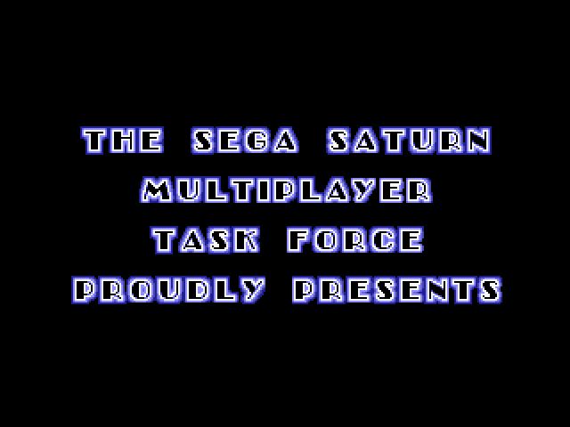
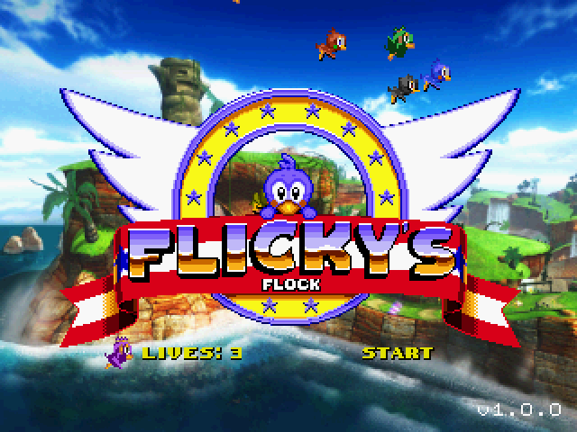
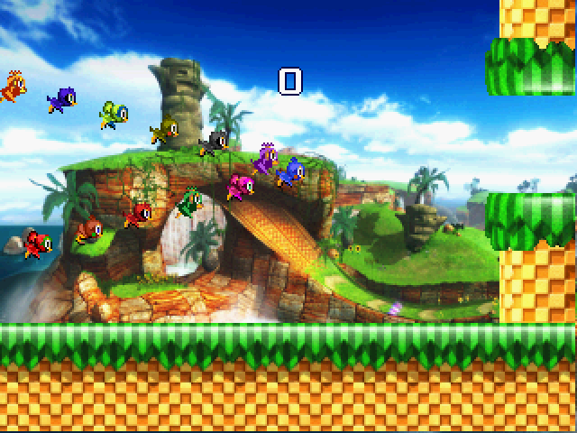
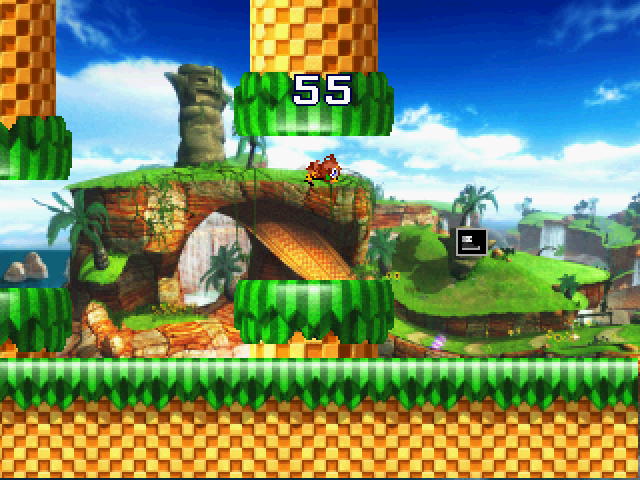
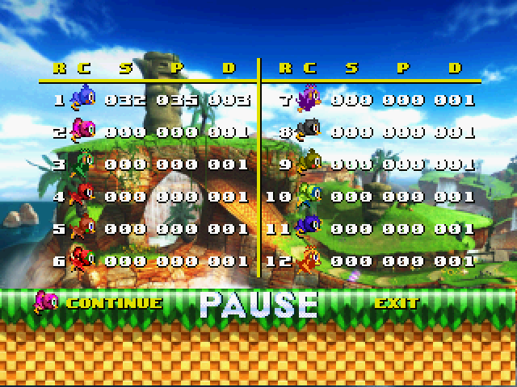
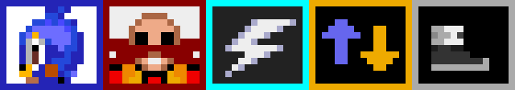

# Flicky's Flock
Flicky's Flock is a 12-player Sonic the Hedgehog themed Flappy Bird clone for the Sega Saturn. Requires two [6 Player Adaptors](https://segaretro.org/Saturn_6_Player_Adaptor) for full twelve player support. Requires a modded Saturn or another method to get code running on actual hardware. Build the code with Jo Engine or grab an ISO from [releases](https://github.com/slinga-homebrew/Flickys-Flock/releases). Note: The release ISO does not contain a sound track. You must supply your own. Suggestions are provided. 

The resolution of the game has been changed to support wide screen televisions:
- Use the zoom feature (not 16:9) in your television
- The top and bottom of the screen will be cut off but the game area will take up the entire TV
- The aspect ratio looks correct

Flicky's Flock was my entry to the [Sega Saturn 26th Anniversary Game Competition](https://segaxtreme.net/threads/sega-saturn-26th-anniversary-game-competition.24626/). 

## Screenshots

## Power-Ups/Power-Downs

* Flicky - extra life
* Robotnik - instant death  
* Lightning - all players shrink and have floatier jumps for 10 seconds  
* Reverse Gravity - gravity reverses for all players for 10 seconds  
* Stone Shoes - all players have higher gravity for 10 seconds  

## Player One Special Commands
Only player one can:  
- interact with the menus  
- pause/display the score with the Start button  
- clear scores with the Z button (at the pause screen)  
- press ABC+Start to reset the game  

## Score
When player one hit starts or the game ends, the score is displayed. The fields mean the following:

### R
The player's rank among the other players. Can be 1-12. The players are ranked via their score.  
### C
The Flicky 
### S
Total score. Score = number of pipes - number of deaths. Score cannot be negative.  
### P
Number of pipes the player has cleared.  
### D
Number of times the player has died.  

## Recommended Music Tracks
You must supply your own music tracks when burning the ISO. Here are some recommendations:
1) Track 1 - title screen music
2) Track 2 - extra life music
3) Track 3 - gameplay music
4) Track 4 - game over music

## Burning
On Linux I was able to burn the ISO/CUE + WAV with: cdrdao write --force game.cue. 

## Issues
- Slow startup time 
- Sound track not included
- Not as crazy as [Twelve Snakes](https://github.com/slinga-homebrew/Twelve-Snakes)

## Building
Requires Jo Engine to build. Checkout source code folder to your Jo Engine "Projects" directory and run "./compile.sh". 

## Credits
Thank you to [Ponut](https://github.com/ponut64) for performance and PCM help 
Thank you to [Emerald Nova](www.emeraldnova.com) for organizing the Saturn Dev contest
[SegaXtreme](http://www.segaxtreme.net/) - The best Sega Saturn development forum on the web. Thank you for all the advice from all the great posters on the forum.  
[Sega Saturn Multiplayer Task Force](http://vieille.merde.free.fr/) - Other great Sega Saturn games with source code  
[Jo Engine](https://github.com/johannes-fetz/joengine) - Sega Saturn dev environment  
